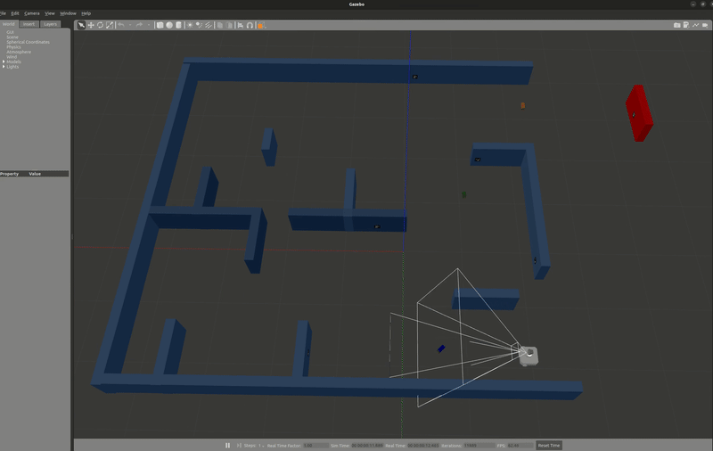

# Part-Detection-and-Maze-Traversal-Using-ArUco-Markers
 This project is a simulation of a TurtleBot that leverages RGB and logical cameras for detecting ArUco markers and identifying floating parts within a maze environment. The detected markers guide robot navigation, while logical camera inputs enable part localization and pose estimation for effective interaction within the maze.

 ## Description
 The RGB camera is employed to detect ArUco markers strategically placed on the walls of the maze. Upon detecting a marker, an aruco_frame is broadcasted using the transform between the camera_rgb_optical_frame and the marker. A TF listener is then used to determine the position of the marker with respect to the odom frame. Based on the detected marker ID, the TurtleBot makes its navigation decisions.

Simultaneously, the logical camera detects parts floating in the environment. These parts are published as messages of type mage_msgs/msg/AdvancedLogicalCameraImage on the topic /mage/advanced_logical_camera/image. When a part is detected, its details—including color and type—are populated within an array (part_poses). Each part's pose is given relative to the logical camera frame (logical_camera_link). A part_frame is broadcasted using the transform between the logical camera and the floating part. A TF listener is then used to determine the pose and orientation of the parts with respect to the odom frame, which is printed to the terminal.

Through continuous processing of ArUco marker detections and logical camera outputs, the TurtleBot is capable of localizing itself within the maze, detecting floating parts, and planning its movements accordingly.

## Start the Simulation
### Place the package into your ROS2 workspace

### Build the package using:
colcon build

### Source the workspace:
source install/setup.bash

### Launch the package:
ros2 launch turtlebot3_gazebo maze.launch.py

## Results
### TurtleBot Maze Navigation and Floating Part Detection

### Pose of Floating Parts in the Odom Frame

## Dependencies

Python 3.10.12

opencv-contrib-python 4.7.0.72